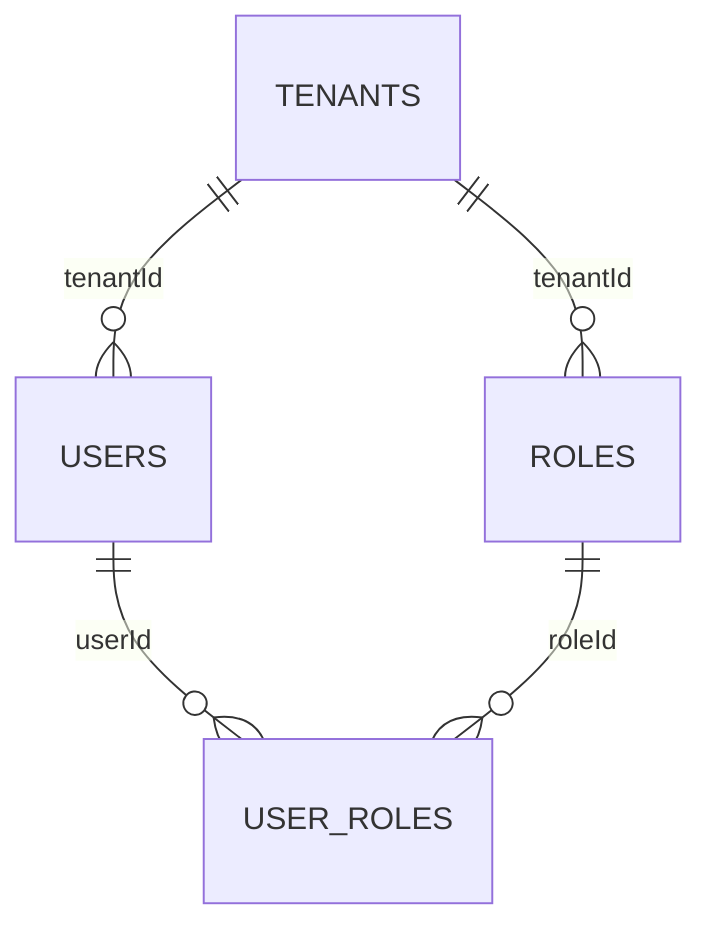
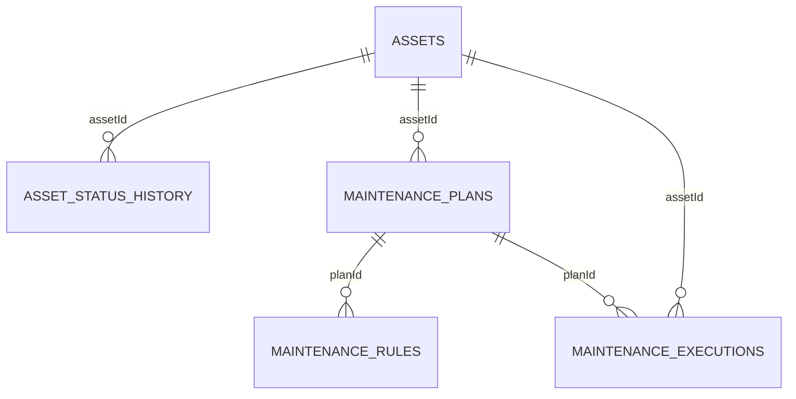
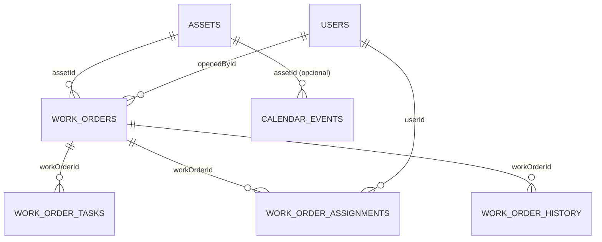
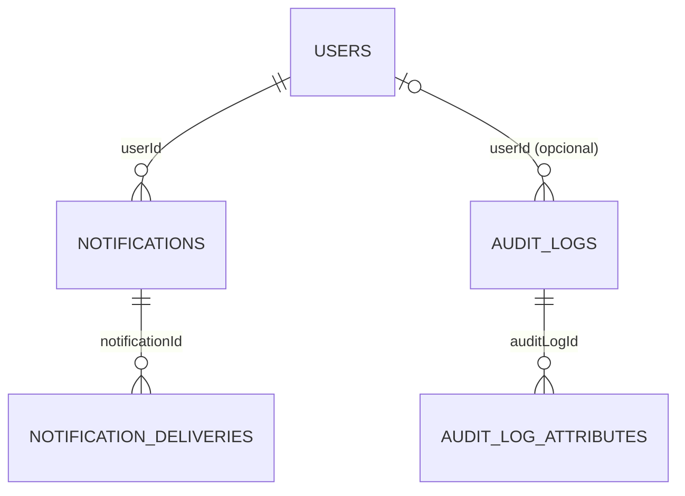
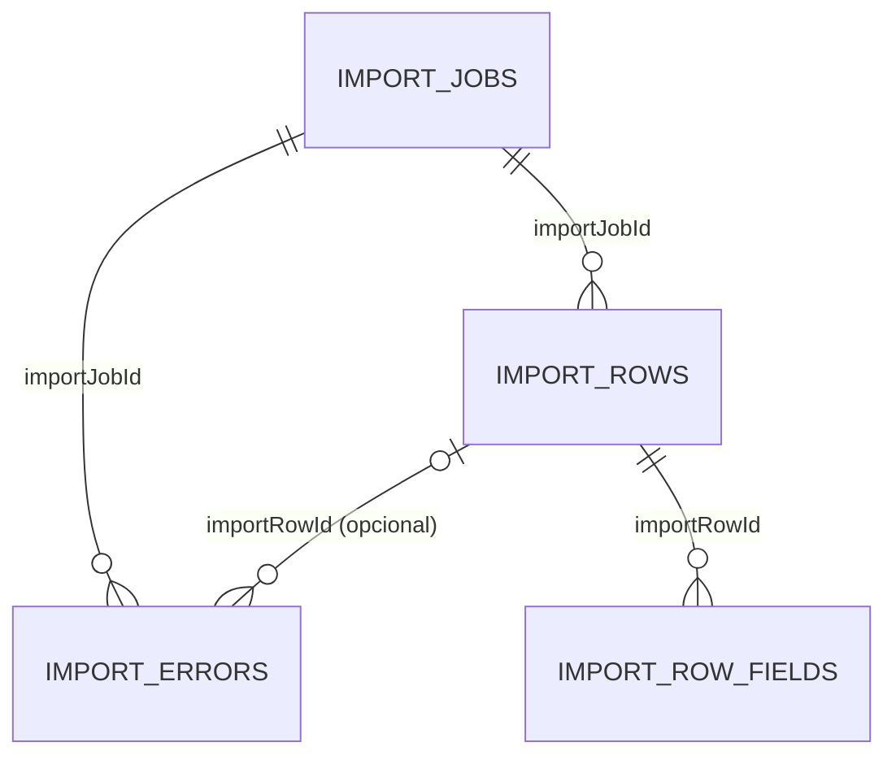
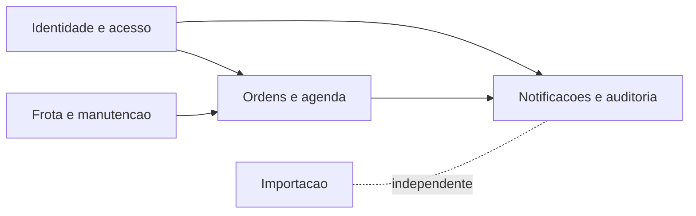

# DER Visual (Sem Sobreposicao)

Fonte oficial de schema: `apps/api/prisma/schema.prisma`  
Base completa (unica): `docs/DER_SCHEMA_ATUAL.dbml`

Este documento entrega o DER em visoes menores de dominio para leitura clara.
Cada bloco abaixo evita cruzamento excessivo de linhas.

## 01) Identidade e acesso

## 02) Frota e manutencao

## 03) Ordens e agenda

## 04) Notificacoes e auditoria

## 05) Importacao

## Mapa macro entre dominios

## Arquivos DBML setoriais (dbdiagram)

- `docs/der-diagramas/01_auth_acesso.dbml`
- `docs/der-diagramas/02_frota_manutencao.dbml`
- `docs/der-diagramas/03_ordens_agenda.dbml`
- `docs/der-diagramas/04_notificacoes_auditoria.dbml`
- `docs/der-diagramas/05_importacao.dbml`
