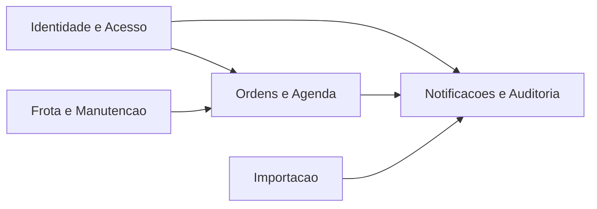
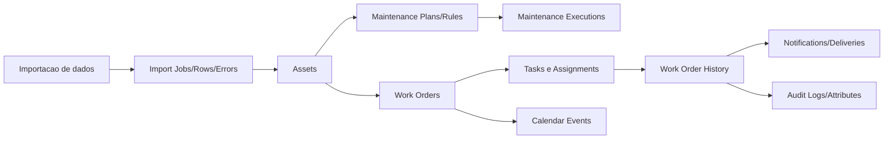
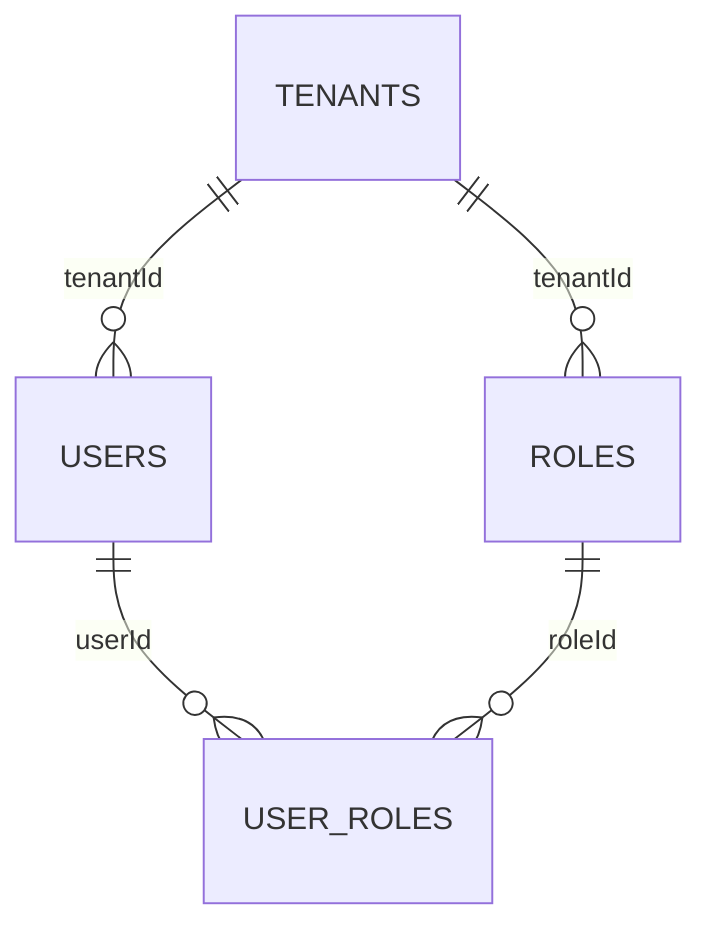
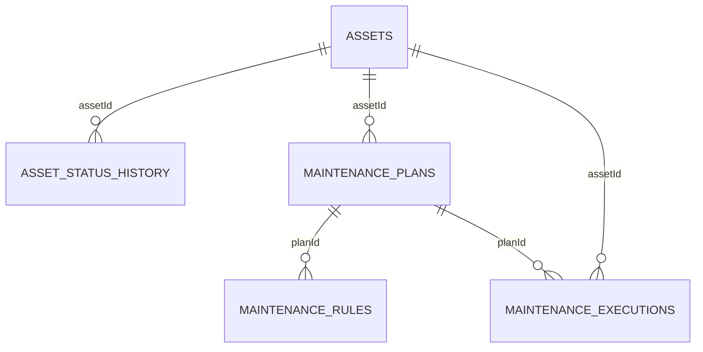
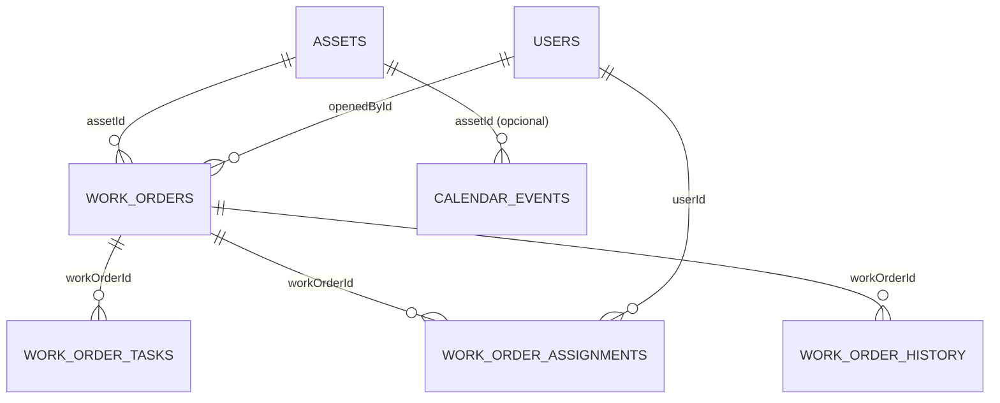
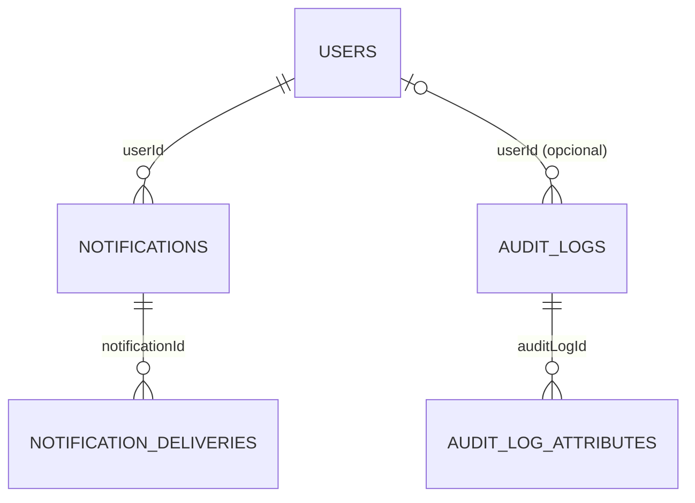
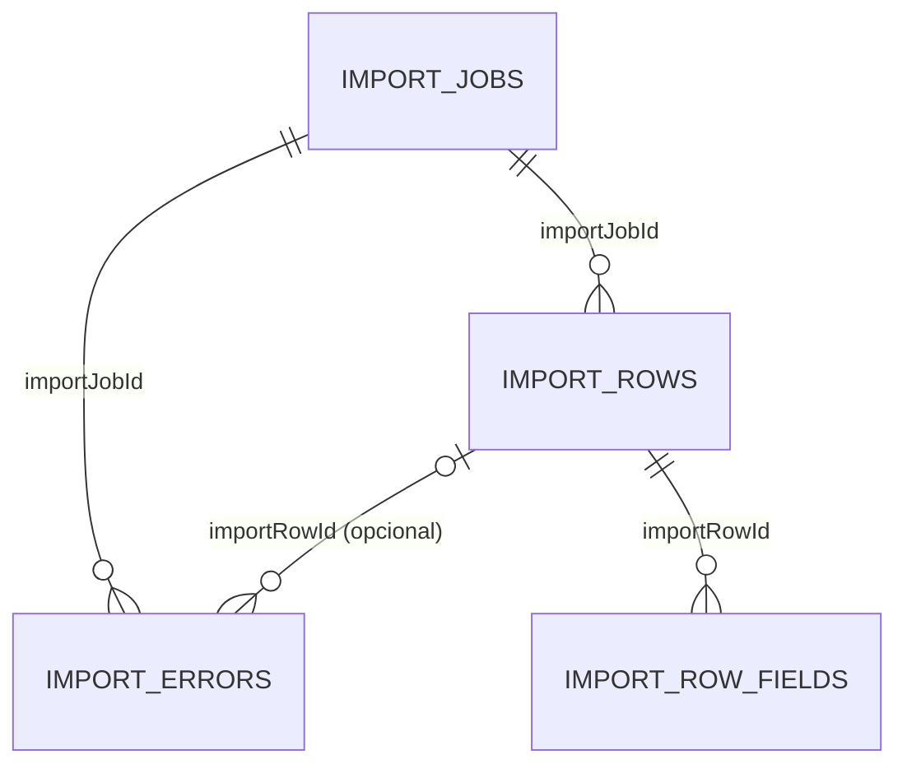

# Visao Executiva do Banco (Prisma + DER)

Este banco foi modelado em PostgreSQL para suportar operacao multi-tenant, manutencao de frota e rastreabilidade de ponta a ponta.  
O schema oficial esta em `apps/api/prisma/schema.prisma` e este material apresenta, objetivamente, como cada bloco funciona.

## Leitura rapida do DER

| Notacao | Significado |
|---|---|
| `A ||--o{ B` | Um registro de `A` pode ter varios registros em `B` (1:N). |
| `A o|--o{ B` | Relacao opcional para `A`, com varios em `B`. |
| `tenantId` | Chave de segregacao por cliente/empresa (multi-tenant). |

## Arquitetura geral

Leitura executiva:
- `Identidade e Acesso` define quem pode operar no sistema.
- `Frota e Manutencao` define os ativos e a logica preventiva.
- `Ordens e Agenda` executa o fluxo operacional diario.
- `Notificacoes e Auditoria` garante comunicacao e trilha de controle.
- `Importacao` garante entrada de dados com governanca.

## Fluxo operacional ponta a ponta

Leitura executiva:
- O ativo nasce ou e atualizado por importacao/cadastro.
- O plano preventivo gera execucoes e alimenta ordens de servico.
- A OS e executada por tarefas e atribuicoes, com historico rastreavel.
- Eventos de agenda, notificacoes e auditoria fecham o ciclo de controle.

## 1) Identidade e Acesso

Explicacao objetiva:
- `tenants` isola dados por cliente/empresa.
- `users` concentra identidade de acesso.
- `roles` define perfil funcional (admin, gestor, tecnico).
- `user_roles` implementa permissao granular por usuario.

### Tabela tenants: papel central no sistema
- A tabela `tenants` (no schema mapeada para `tenants`) e a raiz de multi-tenant do sistema.
- Ela representa cada cliente/empresa e garante segregacao de dados por `tenantId`.
- Sem essa tabela, nao existe isolamento seguro entre operacoes de empresas diferentes.

`tenants` aparece em 3 lugares principais no projeto:
- Definicao oficial do modelo: `apps/api/prisma/schema.prisma` (`model Tenant` com `@@map("tenants")`).
- Carga inicial de dados: `apps/api/prisma/seed.ts` (cria/atualiza o tenant padrao `frota-pro`).
- Uso na aplicacao em runtime: resolucao de `tenant` por slug/id e filtro de consultas por `tenantId` (ex.: `apps/api/src/common/utils/tenant.util.ts` e servicos de dominio).

## 2) Frota e Manutencao

Explicacao objetiva:
- `assets` e o cadastro central da frota.
- `asset_status_history` registra mudancas de disponibilidade e contexto.
- `maintenance_plans` define politica preventiva por ativo.
- `maintenance_rules` guarda os gatilhos (km, horas, data).
- `maintenance_executions` registra execucao real da preventiva.

## 3) Ordens e Agenda

Explicacao objetiva:
- `work_orders` e o documento operacional da manutencao.
- `work_order_tasks` detalha atividades executaveis da OS.
- `work_order_assignments` define responsavel tecnico por OS.
- `work_order_history` preserva historico de status para auditoria.
- `calendar_events` conecta planejamento de agenda com ativo e OS.

## 4) Notificacoes e Auditoria

Explicacao objetiva:
- `notifications` representa comunicacao funcional do sistema.
- `notification_deliveries` controla status por canal de entrega.
- `audit_logs` registra evento de negocio e agente responsavel.
- `audit_log_attributes` detalha metadados do evento auditado.

## 5) Importacao

Explicacao objetiva:
- `import_jobs` controla o processamento do arquivo de entrada.
- `import_rows` preserva rastreabilidade linha a linha.
- `import_errors` registra falhas com codigo e mensagem.
- `import_row_fields` permite analise detalhada por campo importado.

## O que cada bloco responde para a gestao

| Pergunta de negocio | Bloco/Tabelas que respondem |
|---|---|
| Quem pode operar e com qual permissao? | `users`, `roles`, `user_roles` |
| Quais ativos temos e em que situacao estao? | `assets`, `asset_status_history` |
| Quais manutencoes estao planejadas e executadas? | `maintenance_plans`, `maintenance_rules`, `maintenance_executions` |
| Qual o status real das ordens de servico? | `work_orders`, `work_order_tasks`, `work_order_assignments`, `work_order_history` |
| O que esta agendado para os proximos dias? | `calendar_events` |
| Quem foi notificado e por qual canal? | `notifications`, `notification_deliveries` |
| Qual trilha de auditoria de eventos criticos? | `audit_logs`, `audit_log_attributes` |
| Qual a qualidade da importacao e os erros por linha? | `import_jobs`, `import_rows`, `import_errors`, `import_row_fields` |

## Evidencia da base de demonstracao

Base usada para validacao executiva: `frota_demo` (AWS).  
Contagens validadas apos seed:
- `tenants`: 1
- `users`: 3
- `roles`: 3
- `user_roles`: 4
- `assets`: 10
- `work_orders`: 8
- `work_order_tasks`: 4
- `work_order_assignments`: 8
- `work_order_history`: 2
- `calendar_events`: 8
- `maintenance_plans`: 1
- `maintenance_rules`: 1
- `maintenance_executions`: 1
- `notifications`: 2
- `notification_deliveries`: 1
- `audit_logs`: 2
- `audit_log_attributes`: 4
- `import_jobs`: 1
- `import_rows`: 2
- `import_errors`: 1
- `import_row_fields`: 4

## Conclusao executiva
- O modelo esta alinhado ao Prisma e ao DER oficial.
- A estrutura cobre segregacao por cliente, operacao, controle e auditoria.
- O desenho e escalavel e pronto para evolucao com governanca.

## Referencias
- DER completo: `docs/DER_SCHEMA_ATUAL.dbml`
- DER por dominio: `docs/DER_DIAGRAMAS_PTBR.md`
- Reuniao com comandos: `docs/REUNIAO_POPULACAO_TABELAS_PTBR.md`
