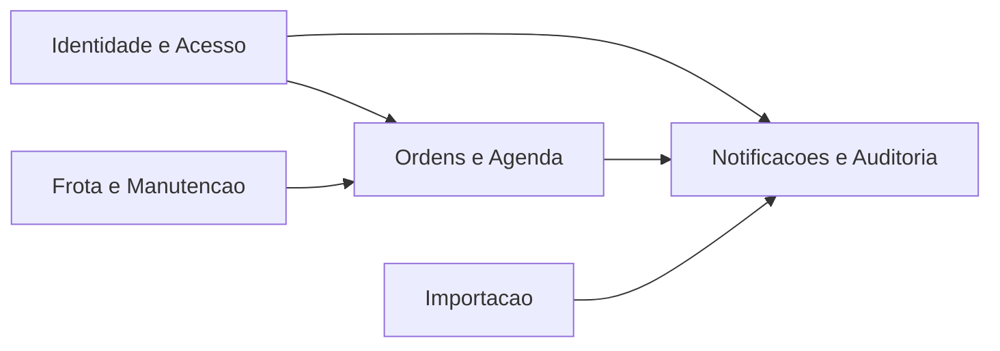
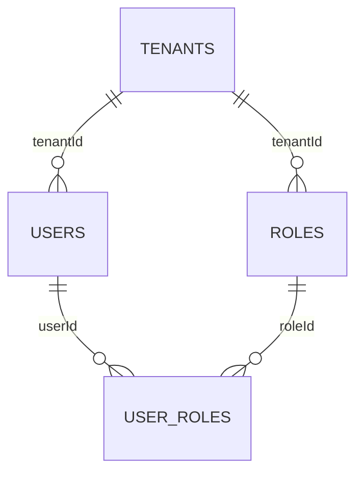
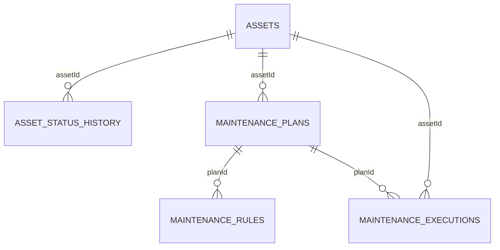
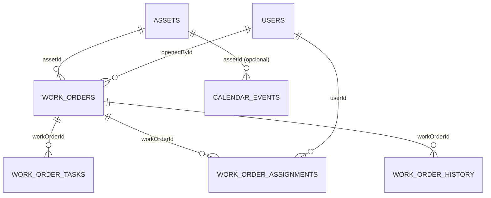
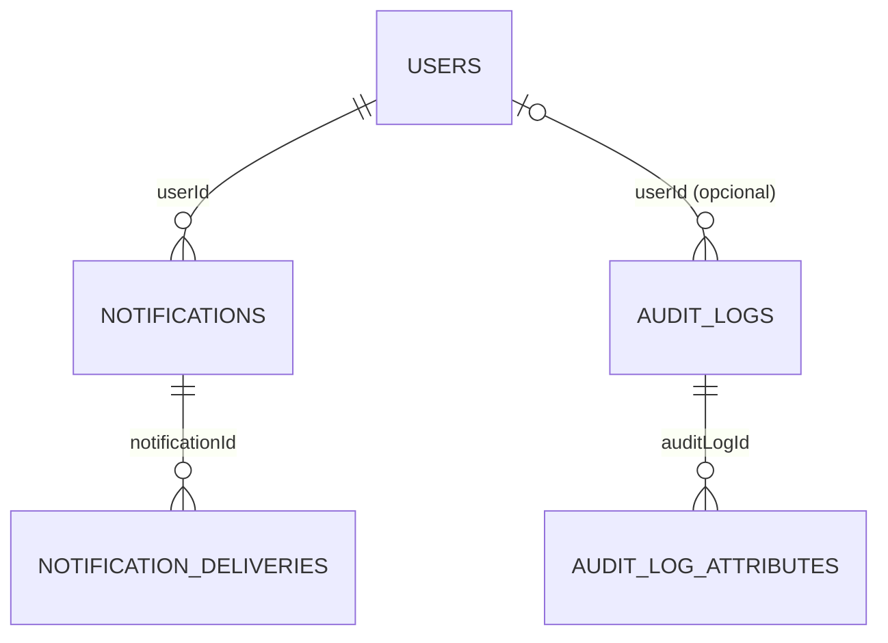
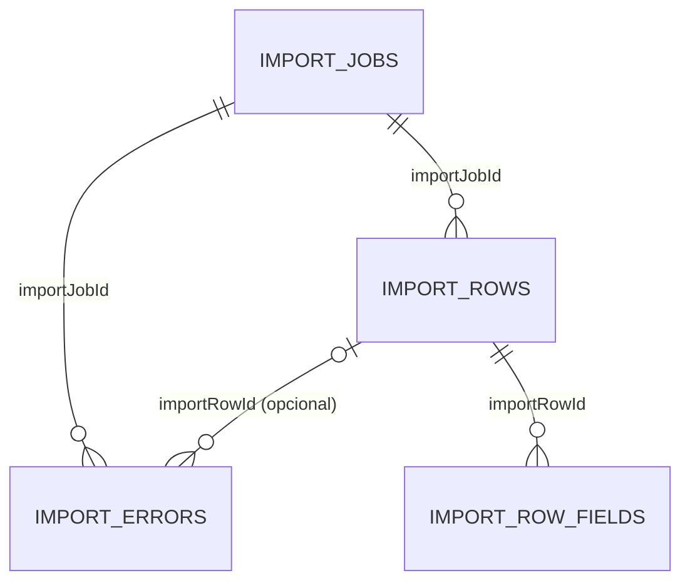

# Reuniao Executiva: Visao do Banco (Prisma + DER)

## Como abrir no VS Code
1. Abra este arquivo.
2. Pressione `Ctrl+Shift+V` para abrir o preview Markdown.
3. Deixe lado a lado com `docs/DER_SCHEMA_ATUAL.dbml`.

## Mensagem inicial (30s)
- Este diagrama representa o banco PostgreSQL atual do projeto.
- O Prisma define o schema oficial.
- O DER mostra relacoes e impacto entre modulos.

## Mapa macro

## 1) Identidade e Acesso

Fala sugerida:
- `tenants` separa dados por cliente.
- `users`, `roles` e `user_roles` controlam autenticacao e permissoes.

## 2) Frota e Manutencao

Fala sugerida:
- `assets` e o cadastro mestre da frota.
- O bloco de manutencao controla plano, regra de gatilho e execucao.

## 3) Ordens e Agenda

Fala sugerida:
- `work_orders` organiza o ciclo operacional.
- `tasks`, `assignments` e `history` explicam execucao e rastreabilidade.
- `calendar_events` mostra o planejamento na agenda.

## 4) Notificacoes e Auditoria

Fala sugerida:
- Notificacao cobre mensagem e entrega por canal.
- Auditoria registra acao, contexto e atributos.

## 5) Importacao

Fala sugerida:
- `import_jobs` controla o processo.
- `rows`, `errors` e `row_fields` permitem auditoria completa do arquivo importado.

## Fechamento (30s)
- O desenho esta coerente com `apps/api/prisma/schema.prisma`.
- O modelo suporta segregacao multi-tenant, operacao de frota e rastreabilidade.
- A base esta pronta para evolucao sem perder governanca.

## Arquivos de apoio
- DER completo: `docs/DER_SCHEMA_ATUAL.dbml`
- DER por dominio: `docs/DER_DIAGRAMAS_PTBR.md`
- Roteiro com comandos: `docs/REUNIAO_POPULACAO_TABELAS_PTBR.md`
